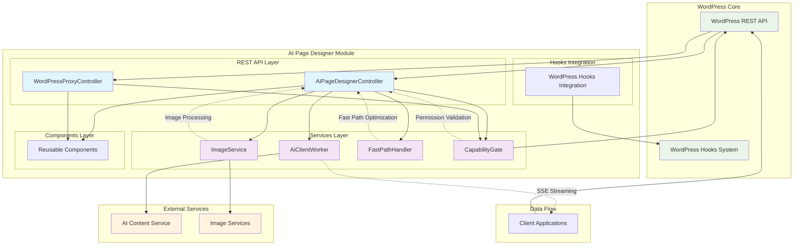

# WordPress AI Page Designer Module - Architecture Documentation

## Overview

The WordPress AI Page Designer Module is a sophisticated WordPress plugin that provides AI-powered page content generation and design capabilities. The module integrates with external AI services to generate, stream, and process content while maintaining WordPress best practices and security standards.

## Architecture Summary

- **48 files** total
- **713 symbols** (functions, classes, methods)
- **14 execution processes** 
- **4 functional areas** with high cohesion (95-100%)

## Functional Areas

### 1. Services Layer (37 symbols, 95% cohesion)
The core business logic layer containing specialized service classes:

- **AiClientWorker**: Handles AI service communication, content generation, and streaming
- **ImageService**: Manages image processing, placeholder detection, and URL replacement
- **FastPathHandler**: Optimizes content processing for performance-critical paths
- **CapabilityGate**: Manages user permissions and feature access control

### 2. REST API Layer (21 symbols, 95% cohesion)
Exposes functionality through WordPress REST API endpoints:

- **AIPageDesignerController**: Primary controller for AI content generation operations
- **WordPressProxyController**: Handles WordPress content operations (CRUD operations)

### 3. Hooks Integration (16 symbols, 100% cohesion)
WordPress hook system integration for seamless plugin ecosystem interaction.

### 4. Components (10 symbols, 100% cohesion)
Reusable component abstractions for UI and functional elements.

## Key Execution Flows

### 1. Image Processing Pipeline
**Process**: `Replace_images_in_html → Is_placeholder_url` (4 steps)
```
replace_images_in_html → update_block_images_recursive → resolve_replacement_url → is_placeholder_url
```
- Handles image replacement in generated HTML content
- Detects placeholder URLs and resolves them to actual image resources
- Maintains content integrity during AI generation process

### 2. Content Streaming
**Process**: `Stream_content → Process_sse_event` (3 steps)
```
stream_content → stream_with_curl → process_sse_event
```
- Implements Server-Sent Events (SSE) for real-time content delivery
- Cross-community process enabling responsive user experience
- Handles streaming communication with external AI services

### 3. Content Generation & Validation
**Process**: `Generate_content → Is_valid_uuid_v4` (3 steps)
```
generate_content → get_conversation_context → is_valid_uuid_v4
```
- Core content generation workflow
- Validates conversation context and maintains session integrity
- Ensures proper UUID-based conversation tracking

### 4. Response Processing
**Process**: `Build_response_payload → Sanitize_block_content` (3 steps)
```
build_response_payload → extract_page_title → sanitize_block_content
```
- Processes AI-generated responses into WordPress-compatible format
- Sanitizes content for security and compatibility
- Extracts structured data like page titles

### 5. Permission Control
**Process**: `Check_permission → Has_ai_page_designer` (3 steps)
```
check_permission → rest_permission → has_ai_page_designer
```
- Implements capability-based access control
- Validates user permissions for AI features
- Integrates with WordPress permission system

## System Architecture Diagram



## Key Design Patterns

### 1. Service-Oriented Architecture
- Clear separation between API controllers and business logic services
- High cohesion within functional areas (95-100%)
- Dependency injection for service orchestration

### 2. Streaming Architecture
- Server-Sent Events (SSE) for real-time content delivery
- Asynchronous processing for improved user experience
- Efficient handling of long-running AI operations

### 3. Security-First Design
- Multi-layer permission validation
- Content sanitization at multiple levels
- WordPress capability integration

### 4. Performance Optimization
- FastPath processing for critical operations
- Efficient image handling and placeholder management
- Optimized content streaming

## Integration Points

### WordPress Integration
- REST API endpoints following WordPress standards
- Hook system integration for extensibility
- Capability system integration for security
- Content management through WordPress core functions

### External Services
- AI content generation services
- Image processing and hosting services
- Real-time streaming protocols

## Security Considerations

- **Capability-based access control**: Multi-step permission validation
- **Content sanitization**: All AI-generated content is sanitized before use
- **Input validation**: UUID validation and context verification
- **WordPress security standards**: Follows WordPress security best practices

## Performance Features

- **Streaming responses**: Real-time content delivery via SSE
- **Fast path processing**: Optimized workflows for common operations
- **Efficient image handling**: Smart placeholder detection and replacement
- **Conversation context management**: Session-based conversation tracking

This architecture provides a robust, scalable, and secure foundation for AI-powered WordPress page design while maintaining compatibility with the broader WordPress ecosystem.