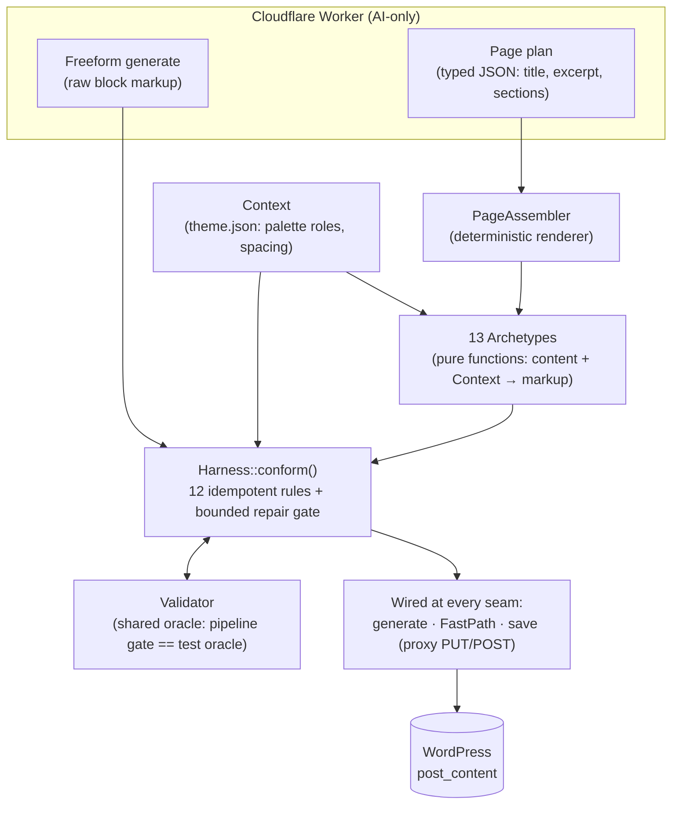

# Markup Harness & Page Assembly — Team Code Walkthrough

A guided tour of the conformance/validation harness (`add/aipd-harness` branch).
Format: ~45–60 min, live code + one demo. Companion to the full design doc,
[`docs/aipd-harness-implementation-plan.md`](../aipd-harness-implementation-plan.md).

---

## 1. The problem (5 min, no code)

The AI returns Gutenberg block markup, and it recurringly gets things wrong in
the *same* ways — defect **classes**, not one-off bugs:

- Asymmetric section padding (e.g. CTA bands with vertical-only padding).
- Invisible text — themes like Twenty Twenty-Five register non-solid palette
  tokens (`accent-6 = color-mix(in srgb, currentColor 20%, transparent)`) and
  the AI happily uses them as text/background colors.
- Buttons whose background matches the section behind them (invisible buttons).
- Raw HTML `<form>` markup with unstyled fields and buttons.
- `placehold.co` placeholder images surviving all the way to publish.
- Preview ≠ published page (WYSIWYG drift) — e.g. motion classes that animated
  in the editor but did nothing on the live site.

The old fix pattern was regex patches scattered across the Cloudflare Worker's
`postProcessMarkup` — untested, duplicated, and running in the wrong place.

## 2. The architecture decision (5 min)

**The harness lives in PHP, not the Worker**, because PHP has:

1. Native `parse_blocks()` / `serialize_blocks()` — real block AST, not regex.
2. The full resolved `theme.json` via `wp_get_global_settings()` — actual
   palette hexes, spacing presets, the facts needed to judge legibility.
3. The last seam before save/render — nothing reaches the database unconformed.

The Worker stays AI-only: it returns markup (freeform flow) or a page-plan
JSON (plan flow), and never post-processes.

Two pillars:

| Pillar | Directory | Strategy |
|---|---|---|
| **Stage 1 — Repair** | `includes/Services/MarkupHarness/` | Conform whatever the AI returns: a pipeline of idempotent rules, gated by a shared Validator. |
| **Stage 2 — Prevention** | `includes/Services/PageAssembly/` | Don't let the AI write structure at all: the AI produces a typed *page plan*, deterministic PHP renders it. Defects become impossible instead of repaired. |

**The one-sentence thesis:** Stage 1 guarantees nothing broken gets published;
Stage 2 makes the common path *correct by construction*, with Stage 1 as a
safety net that provably has nothing to do.

## 3. Stage 1 — MarkupHarness (15 min, code walk)

Walk the files in this order:

### 3.1 `Harness.php` — the pipeline

- `default_rules()` returns the ordered rule list (table below).
- `conform()` runs rules, then validates; a **bounded repair gate** re-runs the
  pipeline only if violations remain, so a pathological input can't loop.
- The key invariant: **every rule is idempotent** — `conform(conform(x)) ===
  conform(x)`. That's what makes conform-before-preview + re-conform-on-save
  WYSIWYG-safe, and it's tested for every rule.

### 3.2 `Context.php` — theme facts

- Resolves palette **roles** (dark / light / accent / muted-light) from
  `wp_get_global_settings()`, using **theme-origin colors only** and skipping
  non-solid tokens.
- Spacing presets: `spacing_attr()` / `spacing_css()` map theme `spacingSizes`
  to `var:preset|spacing|NN` / `var(--wp--preset--spacing--NN)`, with px
  fallbacks.
- War story: the color loop originally *merged* WordPress core's default
  palette with the theme's — brightness-sort then picked pure black/white and
  `vivid-purple` over the theme's real colors ("why is there purple that isn't
  in my theme?"). One missing `break`.

### 3.3 `Validator.php` — the shared oracle

The same violation checks **gate the runtime pipeline and serve as the PHPUnit
test oracle**. When a new defect class appears, the workflow is: add a
Validator assertion (it fails), add a Rule (it passes), and the runtime gate
plus the test suite are updated in a single move. This is the design idea most
worth dwelling on.

### 3.4 The rule pipeline

Read **two** rules fully, not all twelve: `GroupPaddingSymmetry` (small, shows
the Rule shape) and `ColorLegibility` (the meaty one — resolves inherited
backgrounds down the tree, swaps non-solid colors for solid ones, repairs
low-contrast text, patching both block attrs and rendered HTML).

Order in `Harness::default_rules()`:

| # | Rule | Defect class it kills | Validator check |
|---|---|---|---|
| 1 | `RepairDelimiters` | Malformed/unbalanced block comment delimiters | structural parse |
| 2 | `SanitizeCss` | Broken CSS values (`1fr1fr`, bare units) | invalid CSS |
| 3 | `BackgroundImagePlaceholder` | `placehold.co` background-image shadowing a real image in the same inline style (CSS last-wins) | placeholder bg |
| 4 | `UnwrapLoneGroup` | Whole page wrapped in a single redundant group | — |
| 5 | `SectionGroupPattern` | Top-level groups missing `align:wide` + horizontal padding | *(styling default, deliberately not validator-gated)* |
| 6 | `GroupPaddingSymmetry` | Vertical-only padding on section groups (the original CTA bug) | padding symmetry |
| 7 | `ColumnWidthNormalize` | Inconsistent column %-widths (4×50% → 25% each; skips px/auto) | `invalid_column_widths` |
| 8 | `CoverImage` | Cover has a `url` attr but renders no `` element | `cover_missing_image` |
| 9 | `CoverDefaults` | Covers missing minHeight 520 / dimRatio 60 / dark-bg fallback | `cover_missing_defaults` |
| 10 | `StyleRawFormButtons` | Unstyled raw-HTML form buttons | raw form styling |
| 11 | `ButtonBackgroundCollision` | Button bg == inherited section bg (tracks bg inheritance down the tree) | `button_bg_collision` |
| 12 | `ColorLegibility` | Non-solid colors as text/bg; low-contrast text | non-solid / contrast |

### 3.5 Where it's wired — every seam

- `AIPageDesignerController::build_response_payload()` — both generate paths.
- `FastPathHandler::build_response()` — quick edits (image swaps etc.).
- Both `WordPressProxyController` save methods — so even content that somehow
  skipped generation-time conformance is re-conformed on save. Idempotence
  makes this double-pass free.

## 4. Stage 2 — PageAssembly (15 min, code walk)

### 4.1 `PageAssembler.php` — the renderer

- Input: a plan — `[{archetype, content, variant?, background?}, …]` (the AI's
  only job in this flow is filling that JSON; `PagePlanController` owns the
  prompt and schema).
- Deliberately **not** named "Composer" (collides with PHP Composer).
- Two responsibilities live here, *not* in archetypes: image resolution
  (`imageQuery` → `imageUrl` via a DI'd `ImageService`, same pattern as
  `FastPathHandler`) and background rhythm (item override → archetype default →
  alternate `muted_light_slug()` for consecutive plain sections).
- Output still runs through `Harness::conform()` as a belt-and-braces net —
  but see §5 for the proof that the net catches nothing.

### 4.2 `Archetypes/RendersMarkup.php` — the shared trait

Archetypes are **pure functions**: `(content, variant, Context,
background_slug) → markup string`. No network, no WP dependency beyond string
building — which is why they unit-test under a pure-PHP bootstrap. The trait
is where correctness is *structural*:

- `render_section()` — the wide-group-with-heading/intro shape most archetypes share.
- `contrasting_slug()` — loud accent for CTAs, guaranteed to differ from the section bg.
- `card_slug_for_section()` — quiet card swatch; returns null (transparent card) when nothing differs from the section bg — **no collision, by construction**.
- `text_slug_for_background()` — legible text for any resolved bg.
- `render_floating_card()` / `render_gradient_section()` / `render_image_block()` — the modern-variant building blocks.

### 4.3 The catalogue — 13 archetypes

Read one simple archetype end-to-end (`StatsBar` or `Testimonials`), then one
clever one — `PricingTiers` (chained contrast: highlighted card contrasts the
*section*, its button contrasts the *card*) or `BookingForm` (a real `<form>`
inside `core/html`, every field carrying explicit theme-derived inline styles —
the raw-form defect class is impossible, not repaired).

| Archetype | Default variant | Explicit fallback variants | Notes |
|---|---|---|---|
| `heroCover` | hash-of-heading pick | `split`, `image-bg`, `centered`, `stacked` | Deterministic (never random) variety across pages |
| `featureGrid` | `floating-cards` | `cards-3` | |
| `ctaBanner` | `floating-card` | `accent-band` | |
| `alternatingMediaText` | `floating-media` | `flat` | Rounded, drop-shadowed images |
| `bookingForm` | `card` | `stacked` | Real `<form>` in `core/html`; fields color against the *card's* bg |
| `testimonials` | `cards` | `grid-3` | |
| `pricingTiers` | `cards` | `3-tier` | Two chained collision-avoidance computations |
| `faqAccordion` | `cards` | `stacked` | `core/details` — native `
/
`, zero JS |
| `statsBar` | `stat-cards` | `accent-band` | |
| `galleryGrid` | `grid-3` | — | Rows of 3 rounded images, ≤6 |
| `teamGrid` | `cards` | — | ≤4 people, circular avatars |
| `processSteps` | `numbered` | — | Number badge is a real `core/paragraph`, not raw HTML |
| `richText` | `default` | — | |

Motion is also structural: sections emit `data-aos` (scroll-triggered
one-shot), floating cards get `card-hover-lift` — and the motion CSS itself is
single-sourced in `AIPageDesigner::get_motion_css()` for both the preview
iframe and the published frontend (see war stories).

### 4.4 Guardrails upstream (`PagePlanController`)

Worth a quick mention, not a deep read: deterministic section-count guardrails
(`cap_focused_sections()` caps non-homepage plans at 4; homepage minimum of 4
enforced via `pad_homepage_sections()` — a **fresh, isolated** AI call for just
the missing sections, never a "do more" nudge appended to the same thread), a
best-candidate tracker across retries, and a hard `MIN_VISIBLE_TEXT_LENGTH`
gate that fails over to the freeform pipeline rather than shipping a blank page.

## 5. The punchline + demo (10 min)

**The punchline test:** the PageAssembly suite asserts
`(new Validator())->validate($rendered, $ctx) === []` on **raw archetype
output, zero repair passes applied** — for every archetype individually *and*
for a full 13-section composed page. A smoke test additionally proves the
composed page is `Harness::conform()`-**idempotent** (conform is a no-op on
it). "Correct by construction" is an automated assertion, not a slogan.

Demo script:

1. `composer test` — 186 tests green. Point at the composed-page validate-clean
   test and one rule's idempotence test.
2. Generate a page in the browser: the page-plan flow, the progressive
   element-by-element reveal, publish.
3. Compare preview vs published page side by side — the WYSIWYG payoff.

## 6. War stories / Q&A hooks (5 min, pick 2–3)

- **`color-mix` invisible text** — root cause of the whole ColorLegibility
  layer; also fixed at the input side (Worker theme-context filters non-solid
  tokens before the AI ever sees them). Defense in depth.
- **The self-zooming published page** — `get_motion_css()` prepended the scope
  `.entry-content, .wp-block-post-content` verbatim to each selector; the comma
  split it, so bare `.entry-content` got a `pulse 1s infinite` scale animation.
  Lesson: never string-prepend a scope that may be a selector list.
- **Streaming reverted** — true token streaming requires from-scratch AI
  generation, which has no structural guarantee (it once wrapped the entire
  page in `core/columns` — every section a one-character-wide strip).
  Deterministic structure and token streaming are in genuine tension; the
  progressive reveal is the compromise.
- **The nudge-retry that backfired** — asking the model to "expand to at least
  N sections" *in the same thread* made it comply on count while leaving the
  new sections blank. Fresh, narrow, single-purpose calls for just the delta
  are safe; same-thread "do more" is not.
- **`splitTopLevelBlocks` was line-based** — the "pricing table inserted inside
  the hero" bug wasn't the AI at all; the frontend splitter desynced on
  mid-line block delimiters. Rewritten token-based with true depth tracking.

## Presenter prep checklist

- [ ] Local site running (theme: bluehost-blueprint) and page-plan flow verified end-to-end once.
- [ ] `composer test` green (186) and `composer lint` clean, run beforehand.
- [ ] `docs/aipd-harness-implementation-plan.md` open in a tab (catalogue table + locked decisions).
- [ ] Editor tabs pre-opened: `Harness.php`, `Validator.php`, `ColorLegibility.php`, `RendersMarkup.php`, `PricingTiers.php`, the composed-page test.
- [ ] One already-published AI page ready for the preview-vs-frontend comparison.
